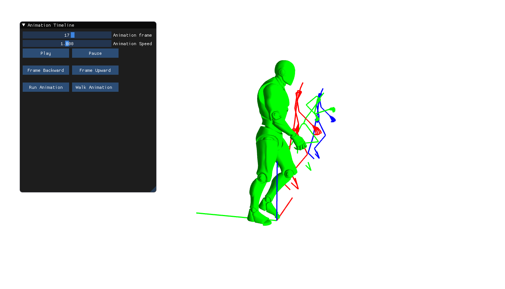

<h1><b>Animation Programming </b></h1>

<b>Team :</b> Antoine Mordant and Bryan Bachelet, <i>ISART DIGITAL</i>

We realised a project about the implementation of our own system of animations. In this project, we managed the bones of the skeleton we had and the vertices of our character. We added the possibility to transition between two animations.

We added the ImGUI library to allow the users to manage the animations and transition in run time.

<h2><b>Architecture</b></h2>

<h3><u>Engine</u></h3>

Our project is based on a premade engine given by our professor. We use it to get the components of our bones and to send the transformation matrices of each bone to the shaders.

<h3><u>Animator</u></h3>

It manages the animations of a skeleton. It stores the animations and applies them on the skeleton. It also manages the transitions.

<h3><u>Skeleton</u></h3>

It contains the animator and the bones. Its main use is to apply the changes given by the animator to every bone and send it to the shaders if it is linked to the mesh.

<h3><u>RendererManager</u></h3>

It contains every skeletons in the scene and draws them.

<h3><u>CSimulation</u></h3>

It is the main program. It store the Renderer Manager.

<h2><b>Challenges</b></h2>

<h3><u>Skeleton</u></h3>

The first challenge of the project was to build the skeleton correctly. The position and rotation of the bones given by the engine was the local ones which means that it is the position and rotation compared to its parent's ones.

Our main difficulties were on this because we used a conversion of matrix4x4 into quaternion. Because of this, the right side of our skeleton was broken : we were missing the right arm and the right leg was lifted. After some research, we found that this conversion is in fact really inaccurate and we deleted it.

<h3><u>Animation</u></h3>

Once we had the skeleton, we had to apply an animation on it. To do so, we had to refresh the bones' position on every frame and to make it smooth. An animation is in fact only defined on a determined number of frame so to make it seems real, you must complete the missing frames by lerping between 2 frames.

<h3><u>Mesh</u></h3>

To apply the skeleton movement on the mesh, we just had to do a little matrix calculation to the bones ones and send it to the engine. After that, it calculates the weights of the bones for every vertex alone.

<h3><u>Transition</u></h3>

To make the transition between 2 animations, we had several difficulties. Each animation had to be played on the same speed and to be lerp between each other smoothly. To do so, our calculations had to be perfect, so it tooks quite some time to succed in having a real smooth transition.

